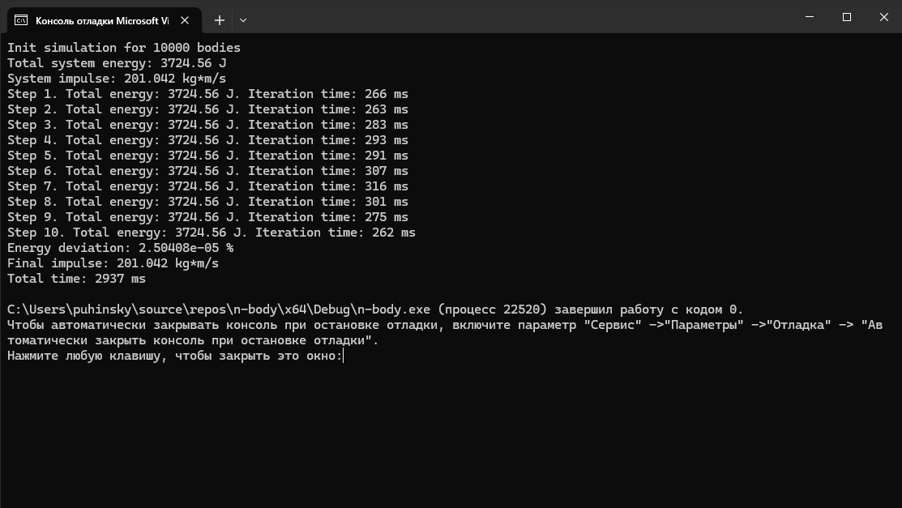

# n-body

## Теория

$$
f_1=f(x_n,y_n),
$$

$$
f_2=f(x_n + \frac{2}{3} h, y_n+\frac{2}{3} h\cdot f_1)
$$

$$
f_3=f(x_n + \frac{2}{3} h, y_n-\frac{h}{3} \cdot f_1 + h\cdot f_2)
$$

$$
y_{n+1}=y_n+\frac{h}{4}(f_1+2f_2+f_3)
$$

[Метод Хойна/Рунге-Кутта, 2, 3, 4 порядок ](https://old.mipt.ru/upload/medialibrary/87d/rk.pdf)

[N-Body на python](https://prappleizer.github.io/Tutorials/RK4/RK4_Tutorial.html)

[Вычисление общей энергии системы n-тел](https://www.math.arizona.edu/~dwang/485home-10/N-body.pdf)

## Отчет

Программа выполняет симуляцию гравитационного взаимодействия n-тел в трехмерном пространстве.

Для решения дифференциальных уравнений используется метод Хойна (Рунге-Кутты) 3 порядка.

При шаге в ```0,1 с``` точность составляет ```±0,6 Дж/с``` для симуляции 10 000 тел.

#### Результат выполнения программы:


<div style="page-break-after: always;"></div>

### Шаг 0: Анализ

Изначально компилятор векторизовал цикл с расчетом потенциальной энергии и раскрутил цикл с расчетом кинетической. Также цикл для расчета ускорений был предикатно оптимизирован. Автоматическая оптимизация остальных циклов не удалась.


#### Summary:


#### Roofline:


#### Hotspots:


#### Memory Access Pattern анализ выявил неэффективный доступ к памяти:


<div style="page-break-after: always;"></div>

### Шаг 1: Векторизация

[step-0-vectorization](https://github.com/Puhinsky/n-body/tree/step-0-vectorization)

Все временные параметры являются средними на 10 запусков.

#### Анализ эффективности различных наборов векторных инструкций:

||SSE (default)|AVX|AVX2|
|---|---|---|---|
|Время, мс|13508,2|13240,0|13585,2|
|Прирост, %|0|2,03|-0,57|

AVX оказался эффективнее, чем AVX2.

#### Анализ влияния оптимизации под целевое оборудование:

||No tune|Tune for Haswell|
|---|---|---|
|Время, мс|13240,0|13039,9|
|Прирост, %|0|1,53|

#### Цикл для расчета кинетической энергии компилятор посчитал невыгодным для simd-фикации

||SIMD|Unroll|
|---|---|---|
|Время, мс|13046,6|13033,2|
|Прирост, %|0|0,10|

Были добавлены выравнивание ```alignas(64)``` и оптимизация ```__restrict```

#### Roofline:


<div style="page-break-after: always;"></div>

### Шаг 2: Оптимизация доступа к памяти

[step-1-memory](https://github.com/Puhinsky/n-body/tree/step-1-memory)

Было добавлен массив для временного хранения ускорений. Обновление значений происходит в отдельном цикле.

#### Сранение эффективности неоптимизированного шаблона доступа к памяти (Forward write) и оптимизированного (Temp write):

||Forward write|Temp write|
|---|---|---|
|Время, мс|13033,2|6733,5|
|Прирост, %|0|93,56|

<div style="page-break-after: always;"></div>

### Шаг 3: Добавление многопоточности

[step-2-suitability](https://github.com/Puhinsky/n-body/tree/step-2-suitability)

#### Оценка пригодности применения многопоточности не показала перспектив:


[step-3-multi-parallel](https://github.com/Puhinsky/n-body/tree/step-3-multi-parallel)

#### Анализ эффективности внедрения многопоточности для различных циклов:

|Многопоточный цикл|Время, мс|Прирост, %|
|---|---|---|
|Нет|6450,4|0|
|Генерации начальных значений|6521,9|-1,10|
|Расчета скоростей и позиций|7211,2|-10,55|
|Расчета ускорений|4160,9|55,02|
|Расчета потенциальной энергии|4970,5|29,77|

#### Реализованные решения:

* Генерация начальных значений – unroll

* Расчет скоростей и позиций – SIMD

* Расчет ускорений – распараллеливание

* Расчет потенциальной энергии – распараллеливание

#### Анализ эффективности способов устранения состояния гонки:

||atomic|temp array + reduction|
|---|---|---|
|Время, мс|1717,5|948,6|
|Прирост, %|0|44,77|

Итоговое время выполнения: 948,6 мс

#### Utilization report:


#### Bottom-up report:


#### Data race check report:


#### Memory leaks check report:


#### Final roofline:


#### Результат выполнения ускоренной программы:



<div style="page-break-after: always;"></div>

#### Итоговое сравнения шагов оптимизации (N = 10 000):

|Шаг|Время, мс|Прирост, %|
|---|---|---|
|0. default|13508,2|0|
|1. vectorization|13046,6|3,54|
|2. memory access pattern|6733,5|100,61|
|3. parallel|948,6|1324,01|

*Приведены средние значения на 10 запусков

### В результате ПО было ускорено в более чем 14 раз.