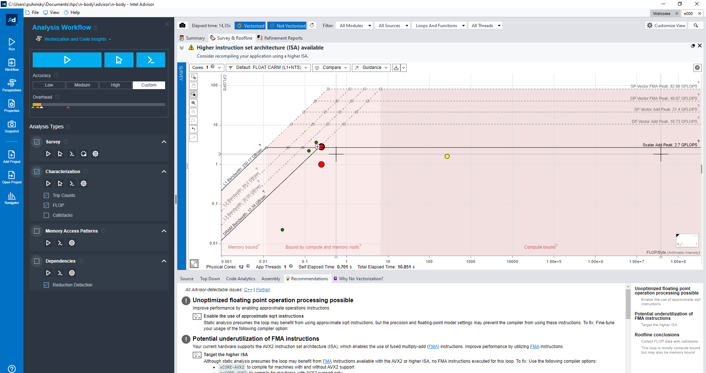
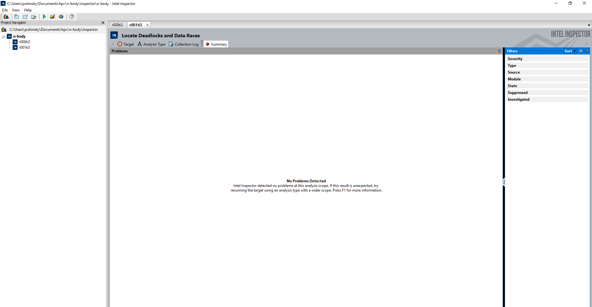
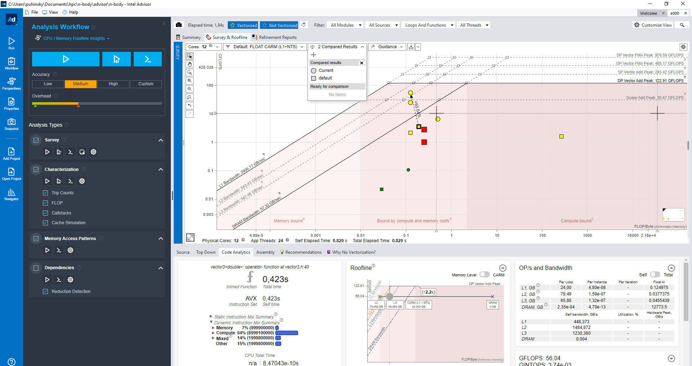

# n-body

## Теория

$$
f_1=f(x_n,y_n),
$$

$$
f_2=f(x_n + \frac{2}{3} h, y_n+\frac{2}{3} h\cdot f_1)
$$

$$
f_3=f(x_n + \frac{2}{3} h, y_n-\frac{h}{3} \cdot f_1 + h\cdot f_2)
$$

$$
y_{n+1}=y_n+\frac{h}{4}(f_1+2f_2+f_3)
$$

[Метод Хойна/Рунге-Кутта, 2, 3, 4 порядок ](https://old.mipt.ru/upload/medialibrary/87d/rk.pdf)

[N-Body на python](https://prappleizer.github.io/Tutorials/RK4/RK4_Tutorial.html)

[Вычисление общей энергии системы n-тел](https://www.math.arizona.edu/~dwang/485home-10/N-body.pdf)

## Отчет

Программа выполняет симуляцию гравитационного взаимодействия n-тел в трехмерном пространстве.

Для решения дифференциальных уравнений используется метод Хойна (Рунге-Кутты) 3 порядка.

При шаге в $0,1$ c точность составляет $2,25 \cdot 10^{-5}$ % для симуляции $10 000$ тел в течении $1$ с.

#### Результат выполнения программы:


<div style="page-break-after: always;"></div>

### Шаг 0: Анализ

Изначально компилятор векторизовал цикл с расчетом потенциальной энергии и раскрутил цикл с расчетом кинетической. Также цикл для расчета ускорений был предикатно оптимизирован. Автоматическая оптимизация остальных циклов не удалась.


#### Summary:


#### Roofline:



#### Hotspots:


#### Memory Access Pattern анализ выявил неэффективный доступ к памяти:


<div style="page-break-after: always;"></div>

### Шаг 1: Векторизация

[step-0-vectorization](https://github.com/Puhinsky/n-body/tree/step-0-vectorization)

Все временные параметры являются средними на 10 запусков.

#### Анализ эффективности различных наборов векторных инструкций:

||SSE (default)|AVX|AVX2|
|---|---|---|---|
|Время, мс|23545,8|22553,3|23480,3|
|Прирост, %|0|4,40|0,28|

AVX оказался эффективнее, чем AVX2.

#### Анализ влияния оптимизации под целевое оборудование:

||No tune|Tune for Haswell|
|---|---|---|
|Время, мс|22553,3|22624,7|
|Прирост, %|0|-0,32|

#### Цикл для расчета кинетической энергии компилятор посчитал невыгодным для simd-фикации

||SIMD|Unroll|
|---|---|---|
|Время, мс|22538,5|22515,5|
|Прирост, %|0|0,10|

Были добавлены выравнивание ```alignas(64)``` и оптимизация ```__restrict```

#### Roofline:


<div style="page-break-after: always;"></div>

### Шаг 2: Добавление многопоточности

[step-2-suitability](https://github.com/Puhinsky/n-body/tree/step-2-suitability)

#### Оценка пригодности применения многопоточности не показала перспектив:


[step-3-multi-parallel](https://github.com/Puhinsky/n-body/tree/step-3-multi-parallel)

#### Анализ эффективности внедрения многопоточности для различных циклов:

|Многопоточный цикл|Время, мс|Прирост, %|
|---|---|---|
|Нет|22515,5|0|
|Генерации начальных значений|22763,17|-1,09|
|Расчета скоростей и позиций|23544,8|-4,37|
|Расчета ускорений|5889,4|282,31|
|Расчета потенциальной энергии|21033,6|7,05|

#### Реализованные решения:

* Генерация начальных значений – unroll

* Расчет скоростей и позиций – SIMD

* Расчет ускорений – распараллеливание

* Расчет потенциальной энергии – распараллеливание

#### Анализ эффективности способов устранения состояния гонки:

||atomic|temp array + reduction|
|---|---|---|
|Время, мс|2970,6|2435,5|
|Прирост, %|0|21,97|

Итоговое время выполнения: 2435,5 мс

#### Utilization report:


#### Bottom-up report:


#### Data race check report:



#### Memory leaks check report:


#### Final roofline:



#### Результат выполнения ускоренной программы:


<div style="page-break-after: always;"></div>

#### Итоговое сравнения шагов оптимизации (N = 10 000):

|Шаг|Время, мс|Прирост, %|
|---|---|---|
|0. default|23545,8|0|
|1. vectorization|22515,5|4,58|
|2. parallel|2435,5|866,77|

*Приведены средние значения на 10 запусков

### В результате ПО было ускорено почти в 10 раз.